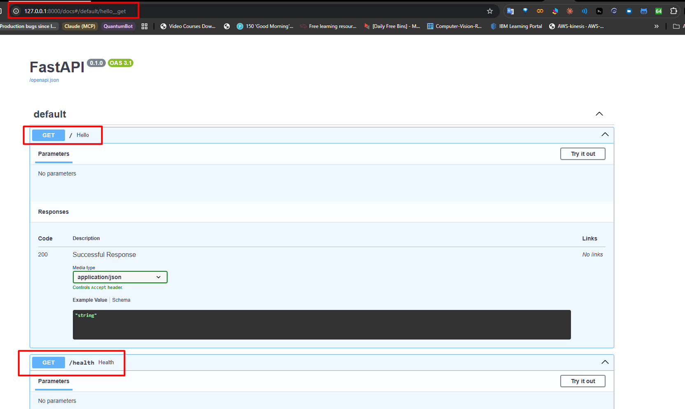

<div align="center">

# FastAPI CI/CD

**Production-grade FastAPI deployment pipeline**
**uv · Podman · GHCR · Helm · Kubernetes**

[](https://github.com/ashishpatel26/fastapi-ci-cd/actions/workflows/ci.yml)
[](https://github.com/ashishpatel26/fastapi-ci-cd/actions/workflows/cd.yml)
[](https://www.python.org/)
[](https://fastapi.tiangolo.com/)
[](https://github.com/astral-sh/uv)
[](https://podman.io/)
[](https://helm.sh/)
[](https://kubernetes.io/)
[](https://ghcr.io/ashishpatel26/fastapi-app)
[](LICENSE)

</div>

---

## Live Preview



---

## Pipeline

```
git push origin main
       │
       ├──► CI
       │     ├── uv sync --frozen
       │     ├── pytest (3 tests)
       │     └── podman build
       │
       └──► CD
             ├── podman login ghcr.io
             ├── podman build :sha + :latest
             └── podman push → ghcr.io/ashishpatel26/fastapi-app
```

---

## Endpoints

| Method | Route | Response |
|--------|-------|----------|
| `GET` | `/` | `{"message": "Hello Production"}` |
| `GET` | `/health` | `{"status": "ok"}` |
| `GET` | `/version` | `{"version": "1.0.0"}` |

---

## Stack

| Layer | Tool |
|-------|------|
| Language | Python 3.14 |
| Framework | FastAPI |
| Package Manager | uv |
| Container | Podman |
| Registry | GHCR |
| CI/CD | GitHub Actions |
| Packaging | Helm |
| Orchestration | Kubernetes / Minikube |

---

## Quick Start

### 1. Clone

```bash
git clone https://github.com/ashishpatel26/fastapi-ci-cd.git
cd fastapi-ci-cd
```

### 2. Install dependencies

```bash
uv sync --frozen
```

### 3. Run locally

```bash
uv run uvicorn main:app --reload
# → http://localhost:8000
# → http://localhost:8000/health
# → http://localhost:8000/version
# → http://localhost:8000/docs
```

### 4. Run tests

```bash
uv run pytest -v
# 3 passed
```

### 5. Build container

```bash
podman build -t fastapi-app .
podman run -p 8000:8000 fastapi-app
```

---

## Deploy to Kubernetes

### Prerequisites

```bash
minikube start
```

### Create GHCR pull secret

```bash
kubectl create secret docker-registry ghcr-secret \
  --docker-server=ghcr.io \
  --docker-username=<your-github-username> \
  --docker-password=<your-pat-token>
```

### Deploy with Helm

```bash
helm install fastapi ./fastapi-chart

# verify
kubectl get pods
kubectl get svc
```

### Access the app

```bash
kubectl port-forward svc/fastapi-fastapi-chart 8000:8000
# → http://localhost:8000
```

---

## CI/CD Secrets Required

| Secret | Description |
|--------|-------------|
| `GHCR_TOKEN` | GitHub PAT with `write:packages` scope |

Add at: `Settings → Secrets and variables → Actions`

---

## Project Structure

```
fastapi-ci-cd/
├── main.py                          # FastAPI app (3 endpoints)
├── tests/
│   └── test_main.py                 # pytest (3 tests)
├── Dockerfile                       # multi-stage, ghcr.io base
├── pyproject.toml                   # uv project config
├── uv.lock                          # locked dependencies
├── fastapi-chart/                   # Helm chart
│   ├── Chart.yaml
│   ├── values.yaml
│   └── templates/
│       ├── deployment.yaml
│       └── service.yaml
├── .github/
│   └── workflows/
│       ├── ci.yml                   # test + build
│       └── cd.yml                   # push to GHCR
├── assets/
│   └── fastapi-running.png
└── steps.md                         # full setup guide
```

---

## Full Setup Guide

See [steps.md](steps.md) for the complete step-by-step walkthrough.

---

## Minikube on Windows

```powershell
$MinikubeDir = "$env:USERPROFILE\bin"
New-Item -ItemType Directory -Path $MinikubeDir -Force | Out-Null
Invoke-WebRequest `
  -Uri "https://github.com/kubernetes/minikube/releases/latest/download/minikube-windows-amd64.exe" `
  -OutFile "$MinikubeDir\minikube.exe" -UseBasicParsing
$UserPath = [Environment]::GetEnvironmentVariable("Path", "User")
if (($UserPath -split ';') -notcontains $MinikubeDir) {
  [Environment]::SetEnvironmentVariable("Path", "$UserPath;$MinikubeDir", "User")
}
minikube version
```

Start with Podman:

```powershell
minikube start --driver=podman --container-runtime=cri-o
```

If `cri-o` fails:

```powershell
minikube delete
minikube start --driver=podman --container-runtime=containerd
```

---

<div align="center">

Built by [ashishpatel26](https://github.com/ashishpatel26)

</div>
